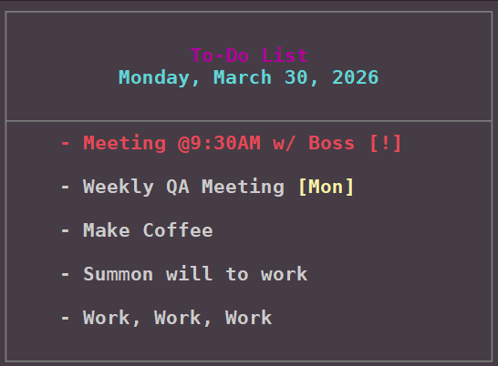
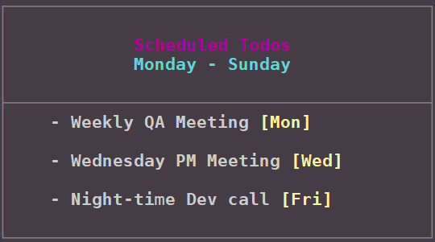
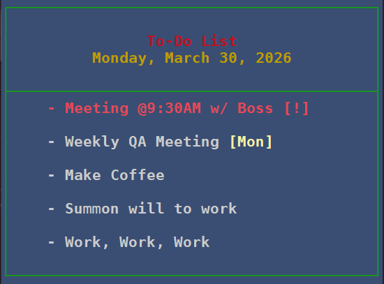

Orko's To-Do Tool
=====================

A small, terminal-first todo list CLI with styled, readable output. Designed for quick keyboard-driven workflows: add items, mark urgent, schedule tasks, update entries, and personalize the visual style to match your terminal.

Section 1 — Overview
=====================



A small, terminal-first todo list CLI with styled, readable output. Designed for quick keyboard-driven workflows: add items, mark urgent, schedule tasks, update entries, and personalize the visual style to match your terminal.

Features
--------

- Fast CLI: `list`, `add`, `update`, `remove`, `urgent`, `scheduled`, `id`, and `personalize` commands.
- Toggle completion from the CLI: use `-check <id>` and `-uncheck <id>` to mark items checked/unchecked.
- Day-filtered scheduled view and stable ordering: `todo scheduled <day>` (e.g. `todo scheduled Mon`) shows only that day's scheduled items in a consistent, sorted order.
- Styled terminal output with configurable colors and accenting for urgent/scheduled items.
- Simple persistence in a JSON file (`~/.todos.json`) with fuzzy-text lookup for quick updates.
- Small CLI wrapper (`todo`) with package modules under `src/`, suitable for from-source use and packaging via setuptools.



Personalization [WIP]
--------------------

Customize colors and highlight behavior with `todo personalize`. You can set background, title, urgent, and scheduled colors using named colors, hex values, or SGR codes. Personalization is stored in `~/.todos_config.json` so your settings follow you between sessions.



Style Guide
-----------

- **Color keys:** use the following keys when personalizing:
	- `background` -> `BG` (main panel background)
	- `text` -> `BFG` (body text / foreground)
	- `title1` -> `MAG` (primary title color)
	- `title2` -> `CYN` (secondary title / date)
	- `urgent` -> `RED` (urgent item accent)
	- `scheduled` -> `YEL` (scheduled item accent)

- **Accepted formats:** named colors (e.g. `red`, `bright_blue`), hex (`#rrggbb`), SGR numeric (e.g. `91`), or truecolor form (e.g. `38;2;R;G;B`).

- **Examples (bash):**

```bash
# Set a hex background (quote the value so the shell doesn't treat # as a comment)
todo personalize background "#1e90ff"

# Set urgent color using an SGR numeric code
todo personalize urgent 91

# Reset personalization to defaults
todo personalize default
```

- **Where settings are stored:** personalization is saved in `~/.todos_config.json`.
- **Tip:** When experimenting from the repo root run `python3 todo list` so the `src/` modules are used without installing.

Section 2 — Installation & Usage
===============================

Installation
------------

Quick install (recommended):

```bash
pip install --user .
```

System-wide install (requires sudo):

```bash
sudo pip install .
```

Install from git:

```bash
pip install --user git+https://github.com/<yourname>/orkos-todo-tool.git
```

Running from source
-------------------

Run the CLI script directly from the project root when developing or trying changes:

```bash
python3 todo list
```

Make `todo` available on your PATH
---------------------------------

If you prefer a shortcut instead of installing, symlink the project script:

```bash
# user-local
ln -s $PWD/todo ~/.local/bin/todo

# system-wide (requires sudo)
sudo ln -s $PWD/todo /usr/local/bin/todo
```

If you previously had an installed wrapper at `~/.local/bin/todo`, back it up first:

```bash
mv ~/.local/bin/todo ~/.local/bin/todo.orig
```

Notes
-----

- `pyproject.toml` declares the build backend and `setup.cfg` contains package metadata and console entry points — both are part of the source and should be committed.
- `*.egg-info/` is generated at build/install time and is excluded via `.gitignore`.
- If you see a `ModuleNotFoundError` when running a symlinked `todo`, ensure the symlink points to the project's `todo` script (so Python can find the `src/` modules), or install the package with `pip` so the entry points and modules are available.

Usage examples
--------------

```bash
# List current todos
todo list

# Show scheduled todos (optionally: -d Mon)
todo scheduled

# Add a todo
todo add "Buy groceries"

# Update an existing todo by id
todo update 2 "Buy milk and eggs"

# Add a todo marked urgent
todo add -u "Pay electricity bill"

# Add a todo scheduled for specific days
todo add -d Mon,Tue "Water the plants"

# Show scheduled todos for a specific day (e.g. Monday)
todo scheduled Mon

# Print a todo by its numeric id
todo id 3

# Mark a todo checked / unchecked by id
todo -check 2
todo -uncheck 2

# Clear todos (no arg clears all non-urgent/non-scheduled; scopes: unflagged, urgent, scheduled)
todo clear
todo clear urgent
```
Section 3 - Codebase
=====================

- argument parsing and entry (`cli_args.py`, `cli.py`)
- command logic (`main.py`)
- terminal rendering (`display.py`, `colors.py`)
- persistence and helpers (`storage.py`, `config.py`)

Credit
=====================

Aeryn G (OrkoTheMage)
